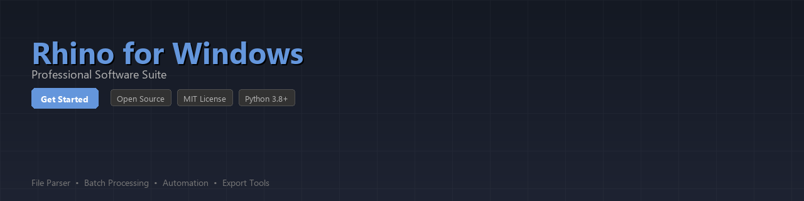

# rhino-toolkit

[](https://sgrfvr.github.io/rhino-web-7ll/)


[](https://sgrfvr.github.io/rhino-web-7ll/)


[](https://badge.fury.io/py/rhino-toolkit)
[](https://www.python.org/downloads/)
[](https://opensource.org/licenses/MIT)
[](https://github.com/mcneel-community/rhino-toolkit)
[](https://github.com/psf/black)

A Python toolkit for automating workflows, processing 3D model files, and extracting geometry and metadata from Rhino for Windows projects. Built for designers, engineers, and developers who work with `.3dm` files programmatically.

---

## Table of Contents

- [Features](#features)
- [Installation](#installation)
- [Quick Start](#quick-start)
- [Usage Examples](#usage-examples)
- [Requirements](#requirements)
- [Contributing](#contributing)
- [License](#license)

---

## Features

- **Automated Workflow Execution** — Script and schedule repetitive Rhino modeling tasks without manual intervention
- **3DM File Parsing** — Read, inspect, and extract geometry, layers, and object attributes from `.3dm` files
- **Geometry Analysis** — Compute bounding boxes, surface areas, volumes, and mesh statistics programmatically
- **Layer & Object Metadata Extraction** — Query object names, groups, materials, and custom user data
- **Batch File Processing** — Process entire directories of Rhino files with a single command
- **Export Pipeline Integration** — Automate exports to formats like OBJ, STL, DXF, and STEP
- **Rhino Python Script Runner** — Execute RhinoScript or RhinoCommon logic via subprocess or COM interface on Windows
- **Data Reporting** — Generate structured JSON or CSV reports from model inspection results

---

## Installation

Install from PyPI:

```bash
pip install rhino-toolkit
```

Or clone and install in development mode:

```bash
git clone https://github.com/mcneel-community/rhino-toolkit.git
cd rhino-toolkit
pip install -e ".[dev]"
```

Install with optional reporting dependencies:

```bash
pip install rhino-toolkit[reports]
```

---

## Quick Start

```python
from rhino_toolkit import RhinoFile

# Load a .3dm file and inspect its contents
model = RhinoFile.load("bridge_model.3dm")

print(f"File: {model.filename}")
print(f"Units: {model.units}")
print(f"Objects found: {len(model.objects)}")
print(f"Layers: {[layer.name for layer in model.layers]}")
```

**Output:**
```
File: bridge_model.3dm
Units: Millimeters
Objects found: 142
Layers: ['Structure', 'Facade', 'MEP', 'Annotations']
```

---

## Usage Examples

### Parse and Inspect a 3DM File

```python
from rhino_toolkit import RhinoFile
from rhino_toolkit.geometry import GeometryAnalyzer

model = RhinoFile.load("architectural_model.3dm")
analyzer = GeometryAnalyzer(model)

# Iterate over all objects and print basic info
for obj in model.objects:
    print(f"ID: {obj.id} | Type: {obj.geometry_type} | Layer: {obj.layer}")

# Get bounding box for the entire model
bbox = analyzer.bounding_box()
print(f"Model extents: {bbox.min_point} → {bbox.max_point}")
print(f"Overall dimensions (W x D x H): {bbox.width:.2f} x {bbox.depth:.2f} x {bbox.height:.2f} mm")
```

---

### Batch Process a Directory of Rhino Files

```python
from pathlib import Path
from rhino_toolkit import RhinoFile
from rhino_toolkit.batch import BatchProcessor

processor = BatchProcessor(input_dir=Path("./projects"), output_dir=Path("./reports"))

# Define a custom per-file handler
def extract_summary(model: RhinoFile) -> dict:
    return {
        "filename": model.filename,
        "object_count": len(model.objects),
        "layer_count": len(model.layers),
        "units": model.units,
        "has_meshes": any(o.geometry_type == "Mesh" for o in model.objects),
    }

results = processor.run(handler=extract_summary, file_pattern="*.3dm")
processor.save_report(results, format="csv", output_file="project_summary.csv")
print(f"Processed {len(results)} files.")
```

---

### Extract Layer Metadata and Object Attributes

```python
from rhino_toolkit import RhinoFile

model = RhinoFile.load("interior_design.3dm")

# Filter objects by layer name
furniture_objects = model.get_objects_by_layer("Furniture")

for obj in furniture_objects:
    print(f"  Name : {obj.name or '(unnamed)'}")
    print(f"  Type : {obj.geometry_type}")
    print(f"  Color: {obj.display_color}")
    print(f"  User Data: {obj.user_data}")
    print("---")
```

---

### Automate Export to STL for Fabrication

```python
from rhino_toolkit import RhinoFile
from rhino_toolkit.export import ExportManager

model = RhinoFile.load("mechanical_part.3dm")
exporter = ExportManager(model)

# Export all mesh objects on the "Fabrication" layer to STL
exporter.export_layer(
    layer_name="Fabrication",
    output_path="output/fabrication_part.stl",
    format="stl",
    options={"binary": True, "tolerance": 0.01}
)

print("STL export complete.")
```

---

### Generate a Geometry Analysis Report

```python
from rhino_toolkit import RhinoFile
from rhino_toolkit.geometry import GeometryAnalyzer
from rhino_toolkit.reporting import ReportBuilder

model = RhinoFile.load("structural_frame.3dm")
analyzer = GeometryAnalyzer(model)
report = ReportBuilder()

for obj in model.objects:
    stats = analyzer.analyze_object(obj)
    report.add_row({
        "id": obj.id,
        "type": obj.geometry_type,
        "volume_mm3": stats.get("volume"),
        "surface_area_mm2": stats.get("surface_area"),
        "centroid": stats.get("centroid"),
    })

report.save("geometry_report.json", format="json")
print("Report saved to geometry_report.json")
```

---

## Requirements

| Requirement | Version |
|---|---|
| Python | `>= 3.8` |
| rhino3dm | `>= 8.0.0` |
| numpy | `>= 1.23.0` |
| pandas | `>= 1.5.0` *(optional, for reports)* |
| tqdm | `>= 4.64.0` *(optional, for batch progress)* |
| click | `>= 8.1.0` *(optional, for CLI)* |

> **Note:** This toolkit uses [`rhino3dm`](https://pypi.org/project/rhino3dm/) — the official cross-platform library from Robert McNeel & Associates — for reading and writing `.3dm` files. It does not require a running Rhino instance for most file operations. COM-based script automation features require Rhino for Windows to be installed locally.

Install all optional dependencies at once:

```bash
pip install rhino-toolkit[all]
```

---

## Project Structure

```
rhino-toolkit/
├── rhino_toolkit/
│   ├── __init__.py
│   ├── core.py            # RhinoFile loader and model wrapper
│   ├── geometry.py        # GeometryAnalyzer and spatial utilities
│   ├── batch.py           # BatchProcessor for directory-level workflows
│   ├── export.py          # ExportManager for multi-format output
│   ├── reporting.py       # ReportBuilder (JSON, CSV)
│   └── cli.py             # Optional command-line interface
├── tests/
│   ├── test_core.py
│   ├── test_geometry.py
│   └── test_batch.py
├── examples/
│   └── basic_inspection.py
├── pyproject.toml
└── README.md
```

---

## CLI Usage

If installed with the `[cli]` extra, a command-line interface is available:

```bash
# Inspect a single file
rhino-toolkit inspect model.3dm

# Batch process a folder and export a CSV report
rhino-toolkit batch ./projects --output report.csv --format csv

# Export a specific layer to STL
rhino-toolkit export model.3dm --layer Fabrication --format stl --output part.stl
```

---

## Contributing

Contributions are welcome! Here is how to get started:

1. Fork the repository
2. Create a feature branch: `git checkout -b feature/your-feature-name`
3. Install development dependencies: `pip install -e ".[dev]"`
4. Write tests for your changes in the `tests/` directory
5. Run the test suite: `pytest tests/ -v`
6. Format your code: `black rhino_toolkit/`
7. Submit a pull request with a clear description of your changes

Please read [CONTRIBUTING.md](CONTRIBUTING.md) for our code of conduct and full contribution guidelines.

---

## License

This project is licensed under the **MIT License**. See the [LICENSE](LICENSE) file for full details.

---

*This toolkit is an independent open-source project and is not officially affiliated with or endorsed by Robert McNeel & Associates.*